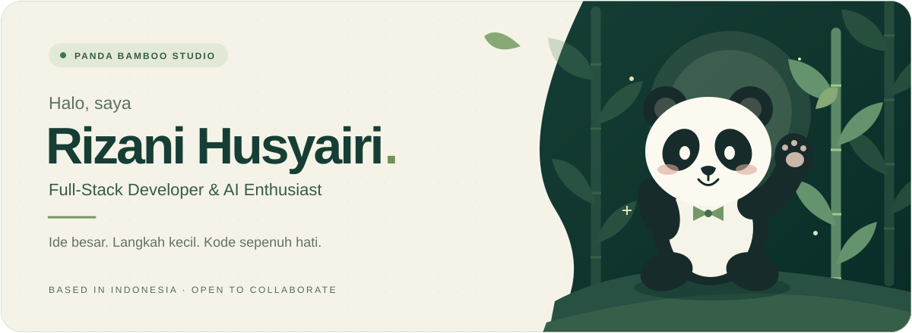
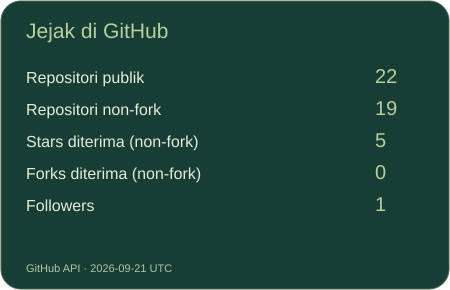
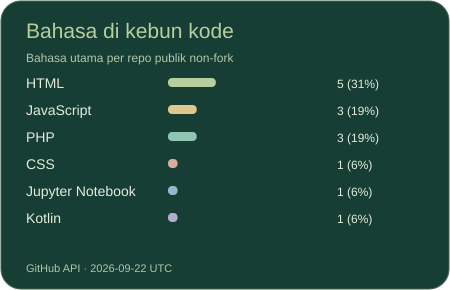
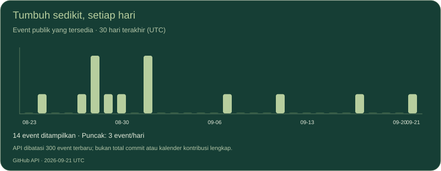

  

    
  <strong>🐼 Selamat datang di sudut bambu saya.</strong>
   
  Tempat ide bertumbuh menjadi web modern, aplikasi AI, dan kolaborasi yang bermakna.
    

  
  
  
  

## 🐾 Kenalan dengan penghuni taman

Saya **Rizani Husyairi**, Full-Stack Software Engineer dari **Indonesia**. Saya senang mengubah ide menjadi aplikasi yang berguna—dari antarmuka web sampai backend dan otomasi.

- 🌱 **Sedang dibangun:** web modern & aplikasi berbasis AI.
- 🎋 **Sedang dipelajari:** Cloud Native, Docker & Kubernetes.
- 🤝 **Mari berkolaborasi:** proyek open source & ide startup kreatif.
- 💬 **Mari ngobrol:** TypeScript, React, Node.js, Python & UI/UX.
- ☕ **Di luar editor:** kopi, artikel teknologi & E-Sports.

**Fokus saat ini:** `Next.js` · `TypeScript` · `FastAPI`

 

## 🎋 Peralatan di kebun kode

**Frontend — tempat ide terlihat**

**Backend & Database — akar yang menopang**

**DevOps & Tools — ruang untuk bertumbuh**

## 🌿 Bertumbuh, satu commit setiap hari

  
  
    
  

Diperbarui otomatis setiap hari dari GitHub API. Grafik menampilkan event publik yang tersedia, bukan jumlah commit. <a href="scripts/README.md">Tentang statistik</a>

## 🍃 Jejak di taman kontribusi

  
Setiap kotak hijau adalah satu langkah kecil dalam perjalanan.

  <picture>
    <source media="(prefers-color-scheme: dark)" srcset="https://raw.githubusercontent.com/RizaniHusyairi/RizaniHusyairi/output/github-contribution-grid-snake-dark.svg" />
    <source media="(prefers-color-scheme: light)" srcset="https://raw.githubusercontent.com/RizaniHusyairi/RizaniHusyairi/output/github-contribution-grid-snake.svg" />
    
  </picture>
    
  <a href="https://github.com/RizaniHusyairi?tab=repositories">Jelajahi proyek saya ↗</a>
  &nbsp; · &nbsp;
  <a href="mailto:rizani.hy681@gmail.com">Punya ide? Mari ngobrol ↗</a>

 

  

